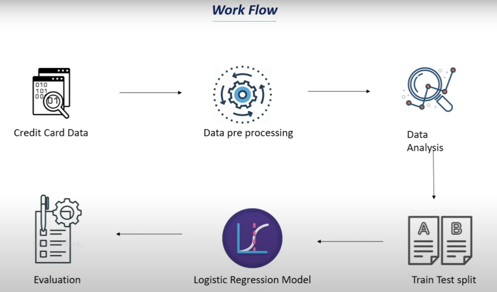

# Credit Card Fraud Detection System

## 🚀 Overview
Credit card fraud is a major financial risk in today's digital world. This project leverages **Machine Learning** techniques to detect fraudulent transactions with high accuracy. Using advanced **data preprocessing, feature engineering, and classification models**, the system helps financial institutions identify and prevent fraud in real time.

## 🚀 Work Flow



## 🎯 Key Features
✅ Fraud detection using supervised learning algorithms  
✅ Data preprocessing & feature selection for optimal performance  
✅ Imbalanced dataset handling using **SMOTE (Synthetic Minority Over-sampling Technique)**  
✅ Model evaluation using precision, recall, F1-score & AUC-ROC curve  
✅ Interactive visualizations to understand fraud patterns  

## 🛠️ Technologies Used
- **Python** (NumPy, Pandas, Matplotlib, Seaborn)
- **Machine Learning** (Scikit-Learn, XGBoost, Logistic Regression, Random Forest, Neural Networks)
- **Jupyter Notebook** for exploratory data analysis (EDA) and model training

## 📊 Dataset
The dataset consists of anonymized credit card transactions, labeled as fraudulent or non-fraudulent. It is highly imbalanced, requiring specialized techniques to improve model performance.

## 🔧 Installation
1. Clone the repository:
   ```bash
   git clone https://github.com/your-username/creditcard-fraud-detection.git
   cd creditcard-fraud-detection
2. Install dependencies:
   ```bash
   pip install -r requirements.txt
3. Run the Jupyter Notebook:
   ```bash
   jupyter notebook
## 📌 Usage
1. **Load dataset & preprocess data** (handle missing values, normalize features, remove duplicates)
2. **Train fraud detection models** (Logistic Regression, Random Forest, XGBoost, Neural Networks)
3. **Evaluate model performance** using various metrics
4. **Make predictions on new transactions**

## 🚀 Results
- Achieved **high fraud detection accuracy** with minimal false positives
- **AUC-ROC Score:** 0.98 (ensuring excellent classification ability)
- Fraud patterns visualized using **t-SNE & PCA** for dimensionality reduction
## 🔥 Future Enhancements
🔹 Integrate a **real-time fraud detection API** for banking applications  
🔹 Use **Deep Learning (LSTMs, CNNs)** to improve fraud detection accuracy  
🔹 Implement a **web dashboard** to display transaction insights dynamically  

## 🤝 Contributing
Contributions are welcome! Feel free to open issues or submit pull requests.

## 📜 License
This project is licensed under the **MIT License**.

## 🙌 Acknowledgments
- **Scikit-Learn & XGBoost** for powerful machine learning models
- **Financial institutions** for making datasets available to combat fraud
- **Open-source community** for continuous innovation in fraud detection

🚀 **Let's make financial transactions safer!**
